# 🤖 Autonomous Analyst Agent - Tiki E-commerce

A project to build an AI-powered autonomous data analyst assistant (Autonomous Analyst Agent) specialized for the Tiki e-commerce platform. The system uses a Multi-Agent architecture combined with a Graph Database and Vector Search to accurately answer complex statistical questions and perform customer sentiment analysis.

The entire system is deployed as a Microservice with FastAPI and packaged with Docker.

**Author:** Trương Quang Huy

---

## 🏗️ System Architecture

The system operates on a decentralized multi-agent model via **LangGraph**, wrapped by the high-speed **FastAPI** framework.

<p align="center">
  
</p>

---

### 🧠 Supervisor Agent (Orchestration Director)

The gateway of communication.  
Uses **Pydantic’s `with_structured_output`** to force the LLM to return a structured JSON routing decision (*RouteDecision*).

- Decides to activate:
  - **Cypher Agent**
  - **GraphRAG Agent**
  - or run both in parallel (**Parallel Execution**)

---

### 🗄️ Cypher Agent (Data Specialist)

Applies a **two-layer prompt discipline**:
- `CYPHER_PROMPT`
- `QA_PROMPT`

Specializes in:
- Converting natural language → **Cypher queries**
- Querying structured data from Neo4j:
  - count items  
  - statistics  
  - pricing  

---

### 🔍 GraphRAG Agent (Semantic Specialist)

Uses a **Retrieval-Augmented Generation (RAG)** pipeline.

Workflow:
- Transform text → **vector embeddings**
- Perform similarity search using **Cosine Similarity**
- Retrieve relevant data (e.g., top reviews)

Capabilities:
- Extract reasons behind user behavior  
- Analyze customer sentiment  
- Generate semantic insights  

---

## 🛠️ Technology & Libraries (Tech Stack)

### ⚙️ Backend Framework & Frontend 
- **FastAPI** – high-speed RESTful API  
- **Uvicorn** – ASGI server for production performance  
- **JWT (JSON Web Tokens)** – secure user authentication  
- **HTML, CSS, JS** – interface user
---

### 🤖 AI & Orchestration
- **langchain** (core, community) – LLM application framework  
- **langgraph** – multi-agent orchestration via graph-based execution  
- **pydantic** – data validation & structured outputs  

---

### 🗄️ Database & Retrieval
- **Neo4j** – graph database storing Nodes & Relationships  
- **langchain-neo4j** – integration for:
  - Vector indexing  
  - Cypher-based QA  

---

### 🧠 Large Language Models (LLM)

**☁️ Cloud API**
- **llama-3.3-70b-versatile** via **Groq API**  
  → ultra-fast inference for:
  - reasoning  
  - routing  
  - response generation  

**💻 Local Model**
- **paraphrase-multilingual-MiniLM-L12-v2** (via langchain-huggingface)  
  - Runs completely offline (zero cost)  
  - Generates **384-dimensional embeddings**  

---

### 🐳 DevOps / Environment
- **Docker** – containerization  
- **Docker Compose** – multi-service orchestration  
- **Windows 11 / WSL 2** – development environment  

---

## 📁 Project Structure
```
AUTONOMOUS_ANALYST_AGENT/
│
├── data/                        # Raw data files from web Tiki(.parquet)
├── flow/                        # Image flow (.svg)
├── src/
│   ├── agents/                  # Core LangGraph agent logic
│   │   ├── cypher_agent.py
│   │   ├── graph_rag_agent.py
│   │   ├── supervisor_agent.py
│   │   └── ingest_full_tiki_graph.py
│   │
│   └── backend/                 # FastAPI Backend
│   │    └── app/
│   │       ├── api/endpoints/   # API Route declarations (message, user)
│   │        ├── auth/           # JWT authentication logic
│   │        ├── db/             # Database connection configuration
│   │        ├── models/         # Pydantic/SQLAlchemy Models
│   │        ├── schemas/        # API Request/Response Schemas
│   │        └── main.py         # FastAPI Server entry point
│   │
│   └── frontend/                # Interface
│       └── index.html
│        └── script.js
│        └── style.css
│
│
├── .env.example                # examplae about .env
├── docker-compose.yml          # Orchestrates Neo4j & AI Backend
├── Dockerfile                  # Python Backend packaging (Debian 12 slim)
├── requirements.txt            # Library list
└── README.md
```

---


## 🚀 Setup & Run Instructions

The project is fully containerized with **Docker**, eliminating environment conflicts.  
Follow the steps below to get the system up and running.

---

### 📌 Prerequisites
- **Docker Desktop** installed and running  

---

### ⬇️ Step 1: Clone project 
Use command : 
```
git clone https://github.com/huyquangtruong05/Autonomous-Analyst-Agent.git
```
### 🔑 Step 2: Declare Environment Variables

Create a file named `.env` in the project root directory and add the following ( Note : you must read files Dockerfile and docker-compose.yml to set up file .env):

```env
# --- NEO4J DATABASE CONFIG ---
# (Note: Keep localhost; Docker will override when containers run)
URI=your_neo4j_uri_here
AUTH_USERNAME=your_neo4j_username_here
AUTH_PASSWORD=your_neo4j_password_here

# --- AI & LLM CONFIG ---
# Enter your Groq API Key to use Llama 3.3
GROQ_API_KEY=your_groq_api_key_here

# --- FASTAPI AUTHENTICATION (JWT) ---
SECRET_KEY=your_secret_key_here
ALGORITHM=your_algorithm_here
ACCESS_TOKEN_EXPIRE_MINUTES=your_expire_minutes_here
```
### 🧩 Step 3: Load Data into the Database (One-time Setup)
The system requires the Vector Index (review_vector) to exist before starting FastAPI
(to avoid initialization errors with LangChain Neo4jVector).
Run the following command:
```
docker-compose run --rm ai_backend python src/agents/ingest_full_tiki_graph.py
```
#### 👉 What happens:
- Starts Neo4j (with APOC plugin)
- Reads data from Parquet files
- Generates vector embeddings
- Creates the vector index
#### 🐙 Notes :
- You can use the username and password you set up in the .env file to log in to the tiki_neo4j port to view the data graphs after loading them into Neo4j.

#### ⏱️ Estimated time: 5–10 minutes

### ▶️ Step 4: Start the Entire System
After data ingestion completes, start all services:
```
docker-compose up -d --build
```

### 🌐 Step 5: Access & Test the API

Once all containers are Running & Healthy:

1. Open a web browser
(Incognito/Private mode recommended to avoid HTTPS issues)
2. Access Swagger UI:
```
http://localhost:8000/docs
```
3. Test the system:
- Generate a token via the auth module
- Call the /api/v1/chat endpoint
- Interact with the multi-agent system
- You can open the .html file using the Live Server in Visual Studio Code to test the frontend connection to the backend (fetched APIs already).
